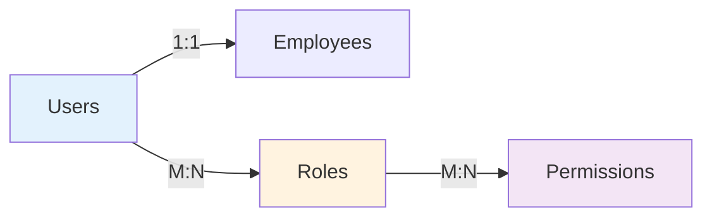
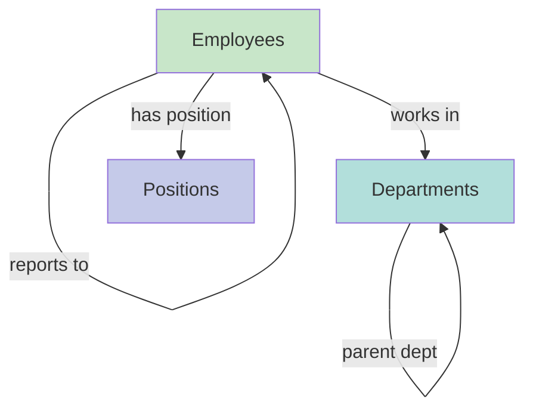
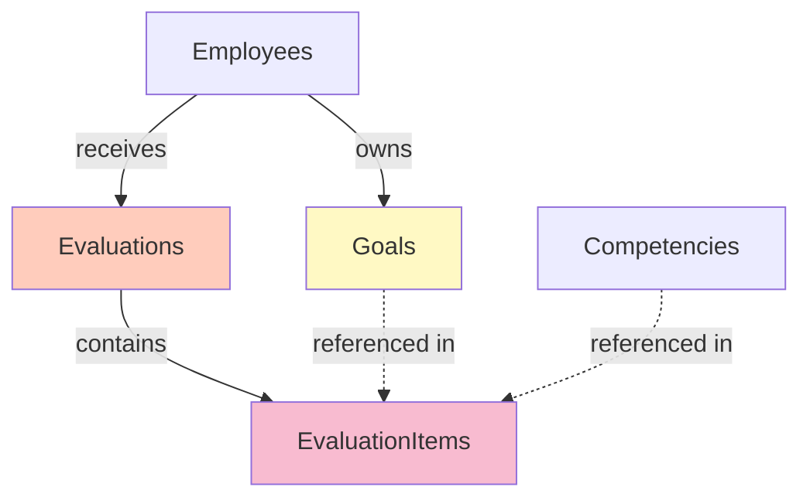
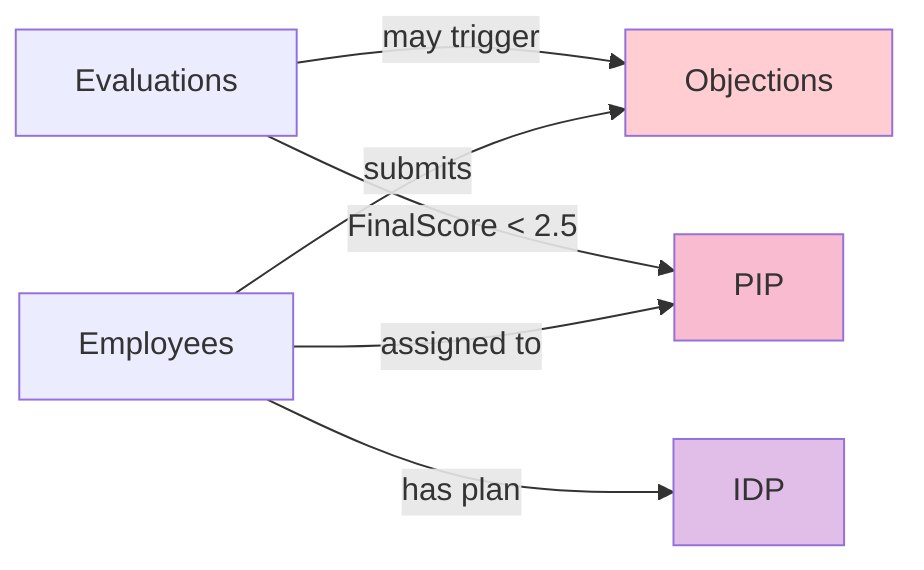
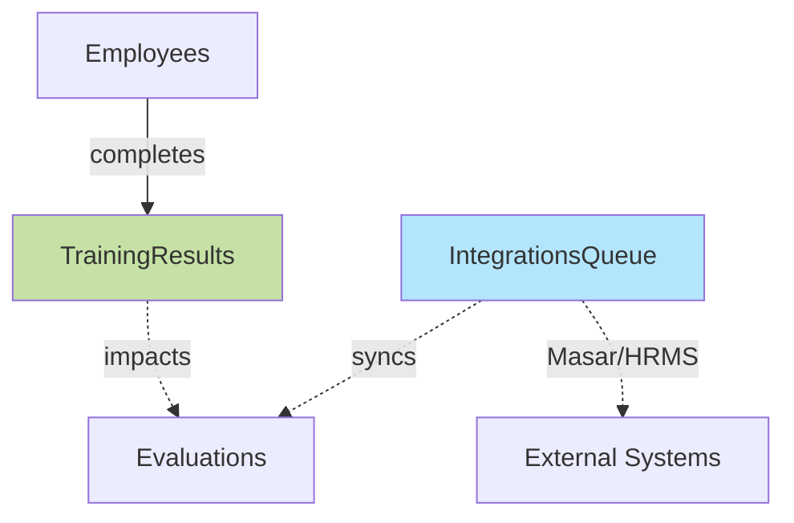
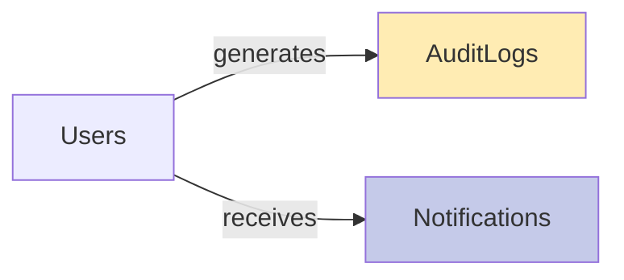
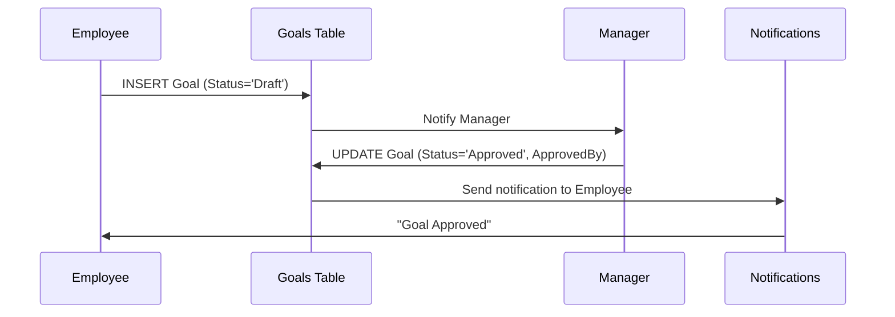
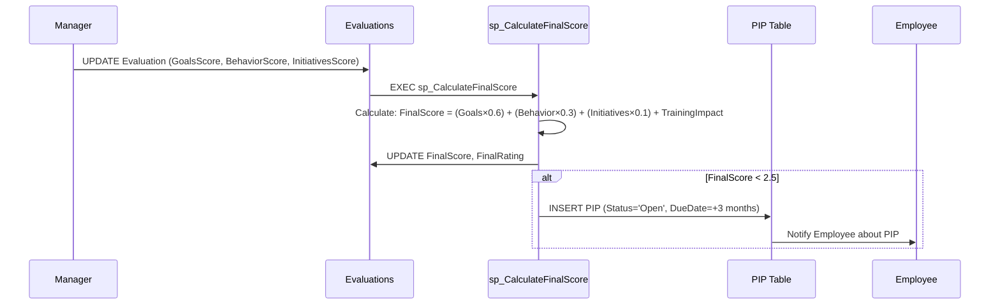
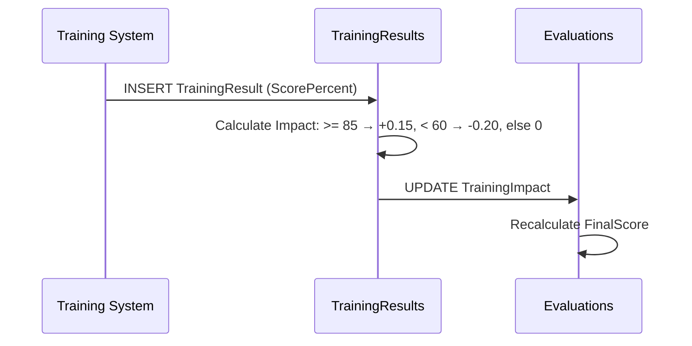

# Database ERD - Visual Diagram
# مخطط قاعدة البيانات التفاعلي

<div dir="rtl">

## 📊 نظرة عامة

هذا المخطط يوضح العلاقات بين 19 جدول في نظام قياس الأداء الوظيفي.

</div>

---

## 🗄️ Complete ERD Diagram

```mermaid
erDiagram
    %% Users & Authentication
    Users ||--|| Employees : "belongs to"
    Users ||--o{ UserRoles : "has many"
    Users ||--o{ AuditLogs : "creates"
    Users ||--o{ Notifications : "receives"

    %% Roles & Permissions
    Roles ||--o{ UserRoles : "assigned to"
    Roles ||--o{ RolePermissions : "has many"
    Permissions ||--o{ RolePermissions : "belongs to"

    %% Organization Structure
    Employees ||--|| Departments : "works in"
    Employees ||--|| Positions : "has position"
    Employees ||--o| Employees : "reports to (Manager)"
    Departments ||--o| Departments : "parent department"

    %% Goals & Performance
    Employees ||--o{ Goals : "owns"
    Employees ||--o{ Evaluations : "receives"
    Evaluations ||--o{ EvaluationItems : "contains"
    Goals ||--o{ EvaluationItems : "referenced in"
    Competencies ||--o{ EvaluationItems : "referenced in"

    %% Objections & Improvement
    Evaluations ||--o{ Objections : "may have"
    Employees ||--o{ Objections : "submits"
    Evaluations ||--o| PIP : "may trigger"
    Employees ||--o{ PIP : "assigned to"
    Employees ||--o{ IDP : "has plan"

    %% Training
    Employees ||--o{ TrainingResults : "completes"

    %% Integration & Monitoring
    IntegrationsQueue ||--o{ Evaluations : "syncs"

    Users {
        uniqueidentifier UserId PK
        uniqueidentifier EmployeeId FK
        nvarchar Username UK
        nvarchar Email UK
        bit IsActive
        datetime2 LastLoginAt
        datetime2 CreatedAt
        datetime2 UpdatedAt
    }

    Employees {
        uniqueidentifier EmployeeId PK
        nvarchar NationalId UK "encrypted"
        nvarchar EmployeeNumber UK
        nvarchar FullNameAr
        nvarchar Email UK
        int DepartmentId FK
        int PositionId FK
        uniqueidentifier ManagerId FK "self-ref"
        date HireDate
        nvarchar Status "Active/OnLeave/Terminated"
        bit IsActive
    }

    Departments {
        int DepartmentId PK
        nvarchar DepartmentCode UK
        nvarchar DepartmentNameAr
        nvarchar DepartmentNameEn
        int ParentDepartmentId FK "self-ref"
        bit IsActive
    }

    Positions {
        int PositionId PK
        nvarchar PositionCode UK
        nvarchar PositionNameAr
        nvarchar PositionNameEn
        int Grade "1-15"
        nvarchar JobFamily
        bit IsActive
    }

    Roles {
        int RoleId PK
        nvarchar RoleName UK
        nvarchar RoleNameAr
        nvarchar Description
        bit IsActive
    }

    Permissions {
        int PermissionId PK
        nvarchar PermissionName UK
        nvarchar PermissionNameAr
        nvarchar Module
        nvarchar Description
    }

    UserRoles {
        int UserRoleId PK
        uniqueidentifier UserId FK
        int RoleId FK
        datetime2 AssignedAt
    }

    RolePermissions {
        int RolePermissionId PK
        int RoleId FK
        int PermissionId FK
    }

    Goals {
        uniqueidentifier GoalId PK
        uniqueidentifier EmployeeId FK
        nvarchar Title
        nvarchar Description
        nvarchar Type "Strategic/Operational/Development"
        decimal Weight "0-100"
        nvarchar TargetValue
        date StartDate
        date EndDate
        nvarchar Status "Draft/Approved/InProgress/Completed"
        decimal ProgressPercent "0-100"
        datetime2 ApprovedAt
    }

    Evaluations {
        uniqueidentifier EvaluationId PK
        uniqueidentifier EmployeeId FK
        nvarchar Period "2025/2025-Q1"
        nvarchar EvaluationType "Annual/MidYear"
        decimal GoalsScore "0-5"
        decimal BehaviorScore "0-5"
        decimal InitiativesScore "0-5"
        decimal TrainingImpact "-0.20 to +0.15"
        decimal FinalScore "0-5" "encrypted"
        nvarchar FinalRating
        nvarchar Status "Draft/Submitted/Approved"
        nvarchar ManagerNotes
        datetime2 ApprovedAt
    }

    EvaluationItems {
        uniqueidentifier ItemId PK
        uniqueidentifier EvaluationId FK
        nvarchar ItemType "Goal/Competency/Initiative"
        uniqueidentifier RefId "GoalId or CompetencyId"
        nvarchar Title
        decimal Weight "0-100"
        decimal Score "0-5"
        nvarchar Notes
        nvarchar EvidenceUrl
    }

    Competencies {
        int CompetencyId PK
        nvarchar CompetencyCode UK
        nvarchar CompetencyNameAr
        nvarchar CompetencyNameEn
        nvarchar Category "Leadership/Communication/Technical"
        bit IsActive
    }

    Objections {
        uniqueidentifier ObjectionId PK
        uniqueidentifier EmployeeId FK
        uniqueidentifier EvaluationId FK
        nvarchar Reason
        nvarchar Details
        nvarchar AttachmentUrl
        nvarchar Status "Open/Accepted/Rejected/Adjusted"
        nvarchar DecisionNotes
        datetime2 DecidedAt
        datetime2 CreatedAt "SLA: <=5 days"
    }

    PIP {
        uniqueidentifier PipId PK
        uniqueidentifier EmployeeId FK
        uniqueidentifier EvaluationId FK
        nvarchar TargetedSkills "JSON"
        nvarchar PlanJson "JSON"
        date StartDate
        date DueDate
        nvarchar Status "Open/InProgress/Closed"
        nvarchar ProgressNotes
        datetime2 ClosedAt
    }

    IDP {
        uniqueidentifier IdpId PK
        uniqueidentifier EmployeeId FK
        nvarchar SkillsToImprove "JSON"
        nvarchar RecommendedCourses "JSON"
        nvarchar DevelopmentGoals "JSON"
        nvarchar Status "Draft/Active/Completed"
        datetime2 CompletedAt
    }

    TrainingResults {
        uniqueidentifier TrainingResultId PK
        uniqueidentifier EmployeeId FK
        nvarchar CourseId
        nvarchar CourseName
        decimal ScorePercent "0-100"
        bit IsPassed
        decimal Impact "-0.20/0/+0.15"
        date CompletedAt
        bit SentToPerformance
    }

    IntegrationsQueue {
        uniqueidentifier QueueId PK
        nvarchar Target "Masar/HRMS/Training"
        nvarchar EntityType
        nvarchar EntityId
        nvarchar PayloadJson "JSON"
        nvarchar Status "New/Retrying/Sent/Failed"
        int RetryCount
        int MaxRetries "default:3"
        nvarchar LastError
        datetime2 SentAt
    }

    AuditLogs {
        bigint LogId PK
        uniqueidentifier UserId FK
        nvarchar Action "Create/Update/Delete"
        nvarchar Entity
        nvarchar EntityId
        nvarchar OldValue "JSON"
        nvarchar NewValue "JSON"
        nvarchar IpAddress
        datetime2 CreatedAt
    }

    Notifications {
        uniqueidentifier NotificationId PK
        uniqueidentifier UserId FK
        nvarchar Type
        nvarchar Title
        nvarchar Message
        nvarchar EntityType
        nvarchar EntityId
        bit IsRead
        datetime2 ReadAt
        datetime2 CreatedAt
    }
```

---

## 🔗 Entity Relationships Summary

<div dir="rtl">

### 1️⃣ المستخدمون والصلاحيات (Users & Authorization)



**العلاقات:**
- **Users ↔ Employees**: علاقة واحد لواحد (كل حساب مرتبط بموظف واحد)
- **Users ↔ Roles**: علاقةMany-to-Many عبر UserRoles (موظف يمكن أن يكون له أكثر من دور)
- **Roles ↔ Permissions**: علاقة Many-to-Many عبر RolePermissions

---

### 2️⃣ الهيكل التنظيمي (Organization Structure)



**العلاقات:**
- **Employees ↔ Departments**: علاقة Many-to-One (موظفين كثيرين في إدارة واحدة)
- **Employees ↔ Positions**: علاقة Many-to-One (موظفين كثيرين في نفس المسمى)
- **Employees ↔ Employees**: Self-Reference للمدير المباشر (ManagerId)
- **Departments ↔ Departments**: Self-Reference للتسلسل الهرمي

---

### 3️⃣ الأهداف والتقييم (Goals & Evaluation)



**العلاقات:**
- **Employees ↔ Goals**: علاقة One-to-Many (موظف لديه أهداف متعددة)
- **Employees ↔ Evaluations**: علاقة One-to-Many (موظف له تقييمات سنوية/ربعية)
- **Evaluations ↔ EvaluationItems**: علاقة One-to-Many (تقييم واحد يحتوي عناصر متعددة)
- **Goals/Competencies → EvaluationItems**: علاقة منطقية عبر RefId

---

### 4️⃣ الاعتراضات وخطط التحسين (Objections & PIPs)



**العلاقات:**
- **Evaluations ↔ Objections**: علاقة One-to-Many (تقييم قد يحتوي اعتراضات)
- **Evaluations ↔ PIP**: علاقة One-to-One أو Zero (PIP يُفتح تلقائياً إذا الدرجة < 2.5)
- **Employees ↔ IDP**: علاقة One-to-Many (خطط تطوير فردية)

---

### 5️⃣ التدريب والتكامل (Training & Integration)



**العلاقات:**
- **Employees ↔ TrainingResults**: علاقة One-to-Many (موظف يكمل دورات متعددة)
- **TrainingResults → Evaluations**: تأثير غير مباشر على TrainingImpact (-0.20 to +0.15)
- **IntegrationsQueue**: طابور التكامل مع الأنظمة الخارجية (Masar, HRMS, Training System)

---

### 6️⃣ المراقبة والإشعارات (Monitoring & Notifications)



**العلاقات:**
- **Users ↔ AuditLogs**: تتبع جميع العمليات (Create, Update, Delete)
- **Users ↔ Notifications**: إشعارات في الوقت الفعلي

</div>

---

## 📊 Key Relationships Explained

### 🔑 Primary Relationships

| From | To | Type | Cardinality | Description |
|------|-----|------|-------------|-------------|
| Users | Employees | FK | 1:1 | Each user account linked to one employee |
| Employees | Goals | FK | 1:N | One employee has many goals |
| Employees | Evaluations | FK | 1:N | One employee receives multiple evaluations |
| Evaluations | EvaluationItems | FK | 1:N | One evaluation contains multiple items |
| Evaluations | Objections | FK | 1:N | One evaluation may have objections |
| Evaluations | PIP | FK | 1:1 | Auto-created when FinalScore < 2.5 |
| Employees | Manager | Self-FK | N:1 | Employee reports to manager |
| Departments | Parent | Self-FK | N:1 | Hierarchical department structure |

### 🔗 Many-to-Many Relationships

| Entity A | Join Table | Entity B | Description |
|----------|------------|----------|-------------|
| Users | UserRoles | Roles | Users can have multiple roles |
| Roles | RolePermissions | Permissions | Roles have multiple permissions |

### 🧩 Polymorphic Relationships

| Entity | Relationship | Description |
|--------|--------------|-------------|
| EvaluationItems | RefId → Goals OR Competencies | Can reference either Goal or Competency via RefId + ItemType |

---

## 🎯 Business Rules Enforced by Schema

<div dir="rtl">

### 1. قواعد التقييم (Evaluation Rules)

- **النتيجة النهائية**: `FinalScore = (GoalsScore × 0.6) + (BehaviorScore × 0.3) + (InitiativesScore × 0.1) + TrainingImpact`
- **النطاق**: جميع النتائج بين 0-5 (CHECK Constraints)
- **PIP التلقائي**: يُفتح تلقائياً عند FinalScore < 2.5
- **TrainingImpact**:
  - ≥ 85%: +0.15
  - < 60%: -0.20
  - 60-85%: 0

### 2. قواعد الأهداف (Goals Rules)

- **مجموع الأوزان = 100%**: CHECK Constraint
- **SMART**: يُفرض عبر التطبيق (Title, Description, TargetValue, MeasurementUnit, StartDate, EndDate)
- **الموافقة**: يجب موافقة المدير (ApprovedBy)

### 3. قواعد الاعتراضات (Objections Rules)

- **SLA**: يجب معالجة الاعتراض خلال ≤ 5 أيام عمل
- **الحالات**: Open → UnderReview → Accepted/Rejected/Adjusted
- **الصلاحية**: فترة تقديم الاعتراض 5 أيام من تاريخ التقييم

### 4. قواعد الصلاحيات (Authorization Rules)

- **RBAC**: Role-Based Access Control
- **أدوار محددة مسبقاً**: Employee, Manager, HR, Admin, Executive
- **صلاحيات مجزأة**: Goals.View, Goals.Create, Goals.Update, Evaluation.Finalize, etc.

### 5. قواعد التكامل (Integration Rules)

- **Retry Mechanism**: MaxRetries = 3
- **Exponential Backoff**: 2s, 4s, 8s
- **Target Systems**: Masar, HRMS, Training

</div>

---

## 🔒 Security Features

### Encrypted Fields (AES-256)

- `Employees.NationalId` - رقم الهوية الوطنية
- `Employees.PhoneNumber` - رقم الهاتف
- `Evaluations.FinalScore` - النتيجة النهائية

### Audit Trail

- `AuditLogs` table captures all CRUD operations
- Retention: ≥ 12 months (NCA requirement)
- Fields: UserId, Action, Entity, OldValue, NewValue, IpAddress, CreatedAt

### Soft Delete

- Most tables use `IsActive` flag instead of hard delete
- Preserves referential integrity
- Enables data recovery

---

## 📈 Performance Optimizations

### Indexes Created

```sql
-- Employee lookups (most frequent)
IX_Employees_NationalId
IX_Employees_EmployeeNumber
IX_Employees_DepartmentId
IX_Employees_ManagerId

-- Evaluation queries (complex joins)
IX_Evaluations_EmployeeId
IX_Evaluations_Period
IX_Evaluations_FinalRating
IX_Evaluations_PeriodRating (composite)

-- Goals filtering
IX_Goals_EmployeeId
IX_Goals_Status
IX_Goals_Type

-- Objections SLA tracking
IX_Objections_SLA (filtered: Status IN ('Open','UnderReview'))

-- Audit trail queries
IX_AuditLogs_CreatedAt
IX_AuditLogs_UserId
IX_AuditLogs_Entity
```

### Query Patterns

- **Manager Dashboard**: JOIN Employees + Evaluations + Goals + Objections + PIP
- **HR Reports**: Aggregate queries on Evaluations.FinalRating grouped by Period
- **Employee Profile**: Single record fetch with related Goals and latest Evaluation

---

## 🧪 Data Integrity Constraints

### CHECK Constraints

```sql
-- Scores must be 0-5
CHK_Evaluations_GoalsScore
CHK_Evaluations_BehaviorScore
CHK_Evaluations_FinalScore

-- Weights must be 0-100
CHK_Goals_Weight
CHK_EvaluationItems_Weight

-- Progress must be 0-100
CHK_Goals_ProgressPercent

-- Training scores 0-100
CHK_TrainingResults_ScorePercent
```

### UNIQUE Constraints

```sql
-- Prevent duplicate user accounts
UQ_Users_Username
UQ_Users_Email

-- Prevent duplicate employees
UQ_Employees_NationalId
UQ_Employees_EmployeeNumber
UQ_Employees_Email

-- Prevent duplicate role assignments
UQ_UserRoles (UserId, RoleId)
UQ_RolePermissions (RoleId, PermissionId)
```

### FOREIGN KEY Constraints

- **CASCADE DELETE**: User deletion cascades to UserRoles, Notifications
- **SET NULL**: Manager deletion sets ManagerId to NULL
- **RESTRICT**: Cannot delete Department if Employees exist

---

## 📊 Sample Queries

### 1. Get Employee Complete Profile

```sql
SELECT
    e.FullNameAr,
    e.EmployeeNumber,
    d.DepartmentNameAr,
    p.PositionNameAr,
    m.FullNameAr AS ManagerName,
    (SELECT COUNT(*) FROM Goals WHERE EmployeeId = e.EmployeeId AND Status = 'Approved') AS ActiveGoals,
    ev.FinalScore,
    ev.FinalRating
FROM Employees e
LEFT JOIN Departments d ON e.DepartmentId = d.DepartmentId
LEFT JOIN Positions p ON e.PositionId = p.PositionId
LEFT JOIN Employees m ON e.ManagerId = m.EmployeeId
LEFT JOIN Evaluations ev ON e.EmployeeId = ev.EmployeeId AND ev.Period = '2025'
WHERE e.EmployeeId = @EmployeeId;
```

### 2. Manager Dashboard - Team Performance

```sql
SELECT
    e.FullNameAr,
    ev.FinalScore,
    ev.FinalRating,
    CASE WHEN o.ObjectionId IS NOT NULL THEN 'Has Objection' ELSE 'No Objection' END AS ObjectionStatus,
    CASE WHEN pip.PipId IS NOT NULL THEN 'On PIP' ELSE 'Normal' END AS PIPStatus
FROM Employees e
LEFT JOIN Evaluations ev ON e.EmployeeId = ev.EmployeeId AND ev.Period = '2025'
LEFT JOIN Objections o ON ev.EvaluationId = o.EvaluationId AND o.Status IN ('Open', 'UnderReview')
LEFT JOIN PIP pip ON e.EmployeeId = pip.EmployeeId AND pip.Status IN ('Open', 'InProgress')
WHERE e.ManagerId = @ManagerId
  AND e.IsActive = 1;
```

### 3. HR Report - Rating Distribution

```sql
SELECT
    ev.Period,
    ev.FinalRating,
    COUNT(*) AS EmployeeCount,
    AVG(ev.FinalScore) AS AverageScore
FROM Evaluations ev
WHERE ev.Period = '2025'
  AND ev.Status = 'Approved'
GROUP BY ev.Period, ev.FinalRating
ORDER BY ev.FinalRating DESC;
```

---

## 🔄 Data Flow Examples

### Flow 1: Create & Approve Goal



### Flow 2: Finalize Evaluation & Auto PIP



### Flow 3: Training Impact on Evaluation



---

## 📦 Migration Strategy

### Step 1: Schema Creation

```bash
# Run in order:
1. Tables (no FK): Roles, Permissions, Competencies, Departments, Positions
2. Tables (with FK): Employees, Users
3. Junction tables: UserRoles, RolePermissions
4. Transactional tables: Goals, Evaluations, EvaluationItems, etc.
```

### Step 2: Seed Data

```sql
-- 1. Seed Roles (5 roles)
-- 2. Seed Permissions (16+ permissions)
-- 3. Seed RolePermissions (map permissions to roles)
-- 4. Seed Competencies (8 competencies)
-- 5. Seed Departments (sample)
-- 6. Seed Positions (sample)
-- 7. Seed Test Employees
-- 8. Seed Test Users
```

### Step 3: Indexes & Views

```sql
-- 1. Create all indexes (30+ indexes)
-- 2. Create views (vw_ManagerDashboard, etc.)
-- 3. Create stored procedures (sp_CalculateFinalScore, sp_CreateAutoPIP)
```

### Step 4: Security

```sql
-- 1. Enable Always Encrypted
-- 2. Apply column encryption
-- 3. Configure backup encryption
```

---

## 🎓 ERD Legend

| Symbol | Meaning |
|--------|---------|
| `||--||` | One-to-One |
| `||--o{` | One-to-Many |
| `||--o|` | One-to-Zero-or-One |
| `}o--o{` | Many-to-Many |
| `-.->` | Logical/Computed Relationship |

### Field Annotations

- `PK` - Primary Key
- `FK` - Foreign Key
- `UK` - Unique Key
- `encrypted` - AES-256 encrypted field
- `self-ref` - Self-referencing foreign key
- `JSON` - Stored as JSON string

---

## ✅ Validation Checklist

- [x] All 19 tables defined
- [x] Primary keys on all tables
- [x] Foreign keys with proper referential actions
- [x] Unique constraints where needed
- [x] Check constraints for data validation
- [x] Indexes for performance
- [x] Encryption for sensitive fields
- [x] Audit logging enabled
- [x] Self-referencing relationships (Manager, ParentDepartment)
- [x] Many-to-Many relationships via junction tables
- [x] Business rules enforced in schema

---

**Generated**: November 2025
**Version**: 1.0
**Status**: ✅ Production Ready

